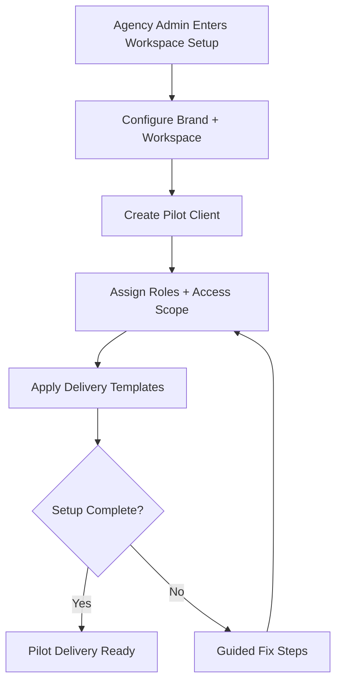
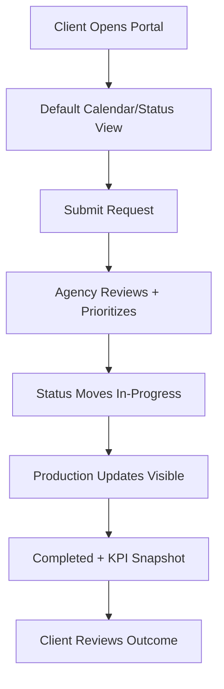

# UX Design Specification avatar

**Author:** Art
**Date:** 2026-03-12

---

<!-- UX design content will be appended sequentially through collaborative workflow steps -->

## Executive Summary

### Project Vision

`avatar` is a white-label B2B platform for agencies to deliver an always-on brand presence system for clients. The MVP UX must optimize for operational speed: launch one pilot quickly, run recurring content workflows from one control surface, and make progress visible to both agency operators and client stakeholders. Branding should build trust, but never slow down execution.

### Target Users

Primary users are agency Product Leads and delivery operators with medium-to-high technical comfort, responsible for setup, role scoping, content operations, and pilot performance tracking. Secondary users are end clients with low-to-medium technical comfort, focused on simple visibility and lightweight request actions.

MVP context is desktop-first for daily operations, with a basic mobile fallback for status and calendar viewing (no full mobile parity). Usage happens mainly at office workstations, plus client calls/meetings where progress and KPI snapshots are presented live.

### Key Design Challenges

- Eliminate fragmented coordination across chats/files by creating one shared operational source of truth.
- Reduce pilot launch time through a guided setup flow that keeps role/access complexity manageable for agency operators.
- Keep the client portal extremely simple (view + request) while preserving clear status transparency and trust.
- Balance white-label brand expression with task speed, ensuring branding supports confidence without adding friction.

### Design Opportunities

- Use the branded content calendar as the default "operating surface" to unify plan, status, and momentum.
- Create a 1-2 click request pattern in the client portal to drive recurring engagement with minimal cognitive load.
- Present progress and manual KPI snapshots in one decision-ready view for agency-client alignment during meetings.
- Design role-aware UX paths so advanced agency controls remain powerful while client interactions stay lightweight.

## Core User Experience

### Defining Experience

`avatar` is a request-centered operating system for agency-client recurring delivery. The dominant user loop is: create request -> triage priority -> progress content production -> communicate outcome. The highest-frequency interaction is request creation/handling; the make-or-break interaction is the request-to-video-generation path. If users cannot quickly create a request, understand its current production state, and trust that it is moving toward video output, the product fails its core UX promise.

### Platform Strategy

MVP is a web application optimized for desktop-first agency operations and client review meetings. Primary interaction mode is mouse/keyboard in browser environments. Mobile support is a fallback only for lightweight monitoring and simple request actions; full mobile parity is explicitly out of MVP scope. Offline mode is out of scope for MVP.

### Effortless Interactions

- Submit a new request in 1-2 clicks from the default portal context.
- Identify urgent items instantly from the primary calendar/status surface without complex filtering.
- Enter a client call and show current status + KPI snapshot from one meeting-ready view in under 10 seconds.
- Move requests through visible states without context-switching to external chats/files.

### Critical Success Moments

- **Client first-time success:** opens branded portal, immediately understands what is active/upcoming/completed, and submits a valid request with minimal guidance.
- **Agency first-time success:** receives a request, sets/updates production status quickly, and communicates progress + KPI snapshot in one flow during a live sync.
- **Make-or-break flow:** request intake -> priority/ownership clarity -> production progression visibility -> video-generation readiness/outcome communication.

### Experience Principles

- **Request-First UX:** Every primary surface reinforces request lifecycle clarity.
- **Operational Speed First:** Prioritize completion speed over decorative complexity in MVP.
- **Single Operational Truth:** Calendar, statuses, requests, and KPI context stay unified.
- **Transparent Progress Signaling:** Users always know what is happening now, what is blocked, and what is next.
- **Brand Supports Trust, Not Friction:** White-label identity strengthens confidence without adding interaction cost.

## Desired Emotional Response

### Primary Emotional Goals

The primary emotional goal for `avatar` is **calm control under operational pressure**. Users should feel that recurring delivery is organized, visible, and manageable, not chaotic. The product should reinforce speed with confidence: actions are quick, status is clear, and progress is trustworthy.

### Emotional Journey Mapping

- **First discovery/login:** "This is clean and clear; I know where to start."
- **Core request workflow:** "I can move work forward fast without friction."
- **Progress review/KPI view:** "I can confidently explain outcomes to a client."
- **Issue or delay moments:** "I still understand what is blocked and what to do next."
- **Return usage:** "This remains the easiest place to run and review pilot operations."

### Micro-Emotions

- Prioritize: **confidence, trust, clarity, momentum, accomplishment**
- Supportive: **professional pride** (agency brand presentation), **reassurance** (status transparency)
- Avoid: **confusion, uncertainty, anxiety, loss of control, hidden-work frustration**

### Design Implications

- **Confidence ->** explicit status labels, clear ownership, unambiguous next-step signals.
- **Trust ->** consistent white-label presentation and reliable KPI/progress surfaces in one view.
- **Momentum ->** low-friction actions (1-2 click request entry, quick updates, minimal navigation hops).
- **Calm under pressure ->** prioritize readability and hierarchy over visual complexity.
- **Accomplishment ->** immediate visual confirmation when requests move forward.

### Emotional Design Principles

- **Clarity First:** Eliminate ambiguity before adding stylistic complexity.
- **Speed Creates Confidence:** Fast completion of core tasks is the primary emotional lever.
- **Visible Progress Builds Trust:** Every user should see what changed, why, and what is next.
- **Professional Calm Over Excitement:** Favor reliability and composure over novelty in MVP.
- **Brand as Assurance:** White-label expression should communicate competence, not decoration.

## UX Pattern Analysis & Inspiration

### Inspiring Products Analysis

- **Linear:** Excellent issue/request lifecycle clarity, low-friction action model, and strong progress visibility.
- **Notion:** Strong information hierarchy for mixed operational and reporting content in one workspace.
- **Trello:** Card-based status movement that makes workflow state transitions explicit and understandable.

### Transferable UX Patterns

- **Request-first default surface:** prioritize incoming work and next actions at entry.
- **Visible lifecycle states:** standardized status chips and timeline signals for "upcoming / in-progress / completed / blocked".
- **Meeting-ready summary panels:** one glance for progress + KPI context during live client sync.
- **Low-click task execution:** keep frequent actions in-place instead of deep navigation.

### Anti-Patterns to Avoid

- Hiding urgent tasks behind filters or multiple tabs.
- Separating requests, status, and KPI into disconnected screens with no narrative continuity.
- Over-designed visuals that reduce scan speed in operational workflows.
- Mobile-parity ambition in MVP that dilutes desktop productivity goals.

### Design Inspiration Strategy

**Adopt:** request board/calendar clarity, status-forward hierarchy, and in-context action controls.  
**Adapt:** collaborative workspace density to desktop-first operational needs.  
**Avoid:** ornamental complexity, fragmented navigation, and analytics-first UX over operations-first UX.

## Design System Foundation

### 1.1 Design System Choice

Themeable system with utility-first tokens and accessible base components (Tailwind + headless primitives approach).

### Rationale for Selection

- Balances speed of implementation with white-label customization needs.
- Supports consistent accessibility behavior without UI lock-in.
- Fits MVP constraint: fast iteration for agency operations without building full custom UI kit from zero.

### Implementation Approach

- Define design tokens (color, type, spacing, radius, elevation, motion).
- Build core shell and recurring workflow components from reusable primitives.
- Enforce component usage through a shared pattern library and review checklist.

### Customization Strategy

- Keep structural UX constant; apply brand via theming layer (logo, accents, neutral scale).
- Limit white-label customization to trust-building zones (header/surface identity), not interaction-critical controls.
- Validate all themes against contrast and readability baselines.

## 2. Core User Experience

### 2.1 Defining Experience

The defining interaction is a request-to-output operational loop where client and agency share one source of truth. The experience must make request creation, urgency triage, production progress, and outcome communication feel immediate and dependable.

### 2.2 User Mental Model

Users currently coordinate through chats/files and expect hidden context-switching. `avatar` should reframe this into one operational canvas where each request has explicit ownership, state, and next action. Users should think "everything important is visible here" instead of "I need to ask in another channel."

### 2.3 Success Criteria

- Users can create or process a request in <= 2 primary actions from the main surface.
- Users can identify urgent items in <= 5 seconds on default view.
- Agency can present current status + KPI snapshot in <= 10 seconds during a client meeting.
- Users can recover from common mistakes with clear inline guidance and no dead-end flows.

### 2.4 Novel UX Patterns

This is a **familiar-pattern composition** (calendar/status/request/KPI) with a unique agency-client white-label operating model. No high-risk novel gesture paradigm is required; innovation comes from tight integration and meeting-ready transparency.

### 2.5 Experience Mechanics

1. **Initiation:** user lands on calendar-status surface with visible priorities.  
2. **Interaction:** create/update/request actions happen inline, tied to item context.  
3. **Feedback:** immediate state confirmation, timestamps, and actor visibility.  
4. **Completion:** item reaches clear outcome state with KPI/context available for review.  
5. **Next-step guidance:** system highlights what should happen next for both client and agency roles.

## Visual Design Foundation

### Color System

- Neutral-first operational palette for clarity and long-session readability.
- Semantic accents: primary (action), success (completed), warning (at-risk), danger (blocked/error), info (context/KPI notes).
- White-label accent channel for agency brand expression without overriding semantic meaning.

### Typography System

- Sans-serif, high-legibility stack optimized for dashboards and medium-density operational content.
- Hierarchy: H1/H2 for page sections, H3 for module headers, body for operational text, caption for metadata.
- Strong numeric readability for KPI and schedule context.

### Spacing & Layout Foundation

- 8px base spacing system with compact desktop rhythm.
- Grid supports calendar + side context patterns at desktop widths.
- Layout bias: scan speed and interaction proximity over decorative whitespace.

### Accessibility Considerations

- WCAG 2.1 AA baseline.
- Focus-visible and keyboard operability across all core actions.
- Contrast-safe semantic colors and state indicators not based on color alone.

## Design Direction Decision

### Design Directions Explored

Explored eight directional variants across density, emphasis, and navigation weight; converged on operations-first direction with moderate density and high status readability.

### Chosen Direction

**Direction:** "Operational Clarity"  
- Calendar/status as primary canvas  
- Lightweight top navigation + contextual side panels  
- Strong state chips and progress affordances  
- Minimal decorative motion

### Design Rationale

- Aligns with core emotional goal: calm control under pressure.
- Maximizes request handling speed and meeting-readiness.
- Preserves white-label trust signal while keeping interaction cost low.

### Implementation Approach

- Build a stable shell and module templates first.
- Implement request lifecycle components before secondary enhancements.
- Use progressive disclosure for advanced controls to keep client UX simple.

## User Journey Flows

### Agency Launches Pilot Client

### Client Request-to-Progress Flow

### Journey Patterns

- Single shared state model across roles.
- Contextual actions close to data objects.
- Explicit ownership and timestamp traces for trust.

### Flow Optimization Principles

- Minimize branch complexity in critical request flows.
- Favor inline confirmation over modal-heavy interaction.
- Preserve continuity between operational status and KPI evidence.

## Component Strategy

### Design System Components

Use base primitives for buttons, form controls, tabs, dialogs, toast/alerts, and layout containers.

### Custom Components

- **Request Composer:** quick-entry, priority, deadline, channel, and context attachments.
- **Status Timeline Strip:** lifecycle visibility with actor/time markers.
- **Meeting Summary Panel:** consolidated progress + KPI + next actions.
- **Calendar State Card:** unified item representation across statuses.
- **Role-Scope Badge Set:** clear access/ownership visualization.

### Component Implementation Strategy

- Compose custom components from tokenized primitives.
- Keep interaction contracts consistent across agency/client surfaces.
- Require keyboard and screen-reader behavior definitions per custom component.

### Implementation Roadmap

1. Core operational components (request composer, status card, lifecycle strip).  
2. Decision-support components (meeting summary, KPI widgets).  
3. Enhancement components (advanced filters, optional density controls).

## UX Consistency Patterns

### Button Hierarchy

- Primary: one per surface for most important forward action.
- Secondary: contextual supporting actions.
- Tertiary/ghost: low-risk utilities.
- Destructive: explicit confirmation and warning semantics.

### Feedback Patterns

- Inline validation for forms.
- Toast for non-blocking success/info.
- Persistent inline banners for blocking states/risks.
- Always show "what changed" after status updates.

### Form Patterns

- Progressive disclosure for optional fields.
- Smart defaults where possible.
- Required fields visibly marked with concise helper text.
- Error messages actionable and field-specific.

### Navigation Patterns

- Stable global navigation by role.
- Local module navigation by task context.
- Keep calendar/status/request journey within one top-level workspace.

### Additional Patterns

- Empty states include immediate next action.
- Loading states preserve layout skeleton to reduce cognitive jump.
- Filter states are visible and resettable in one action.

## Responsive Design & Accessibility

### Responsive Strategy

- Desktop-first optimized for operations and meeting workflows.
- Tablet support for review and light updates.
- Mobile fallback for monitoring and minimal request actions.

### Breakpoint Strategy

- Mobile: 320-767  
- Tablet/Compact Desktop Fallback: 768-1279  
- Desktop (primary acceptance target): 1280+ (validated at 1280/1440/1920)

### Accessibility Strategy

- Target WCAG 2.1 AA.
- Full keyboard support on core workflows.
- Semantic structure with screen-reader labels for key controls and status signals.

### Testing Strategy

- Cross-browser tests: Chrome, Edge, Firefox, Safari (latest two stable).
- Keyboard-only and focus-order checks on all critical flows.
- Automated contrast and semantic audits + manual assistive-tech verification on pilot flows.

### Implementation Guidelines

- Mobile-first CSS foundation with desktop-priority layout tuning.
- Use semantic HTML and ARIA only where semantic elements are insufficient.
- Keep touch targets >= 44x44 on fallback mobile actions.
- Maintain state visibility across breakpoints (no hidden critical progress data).
